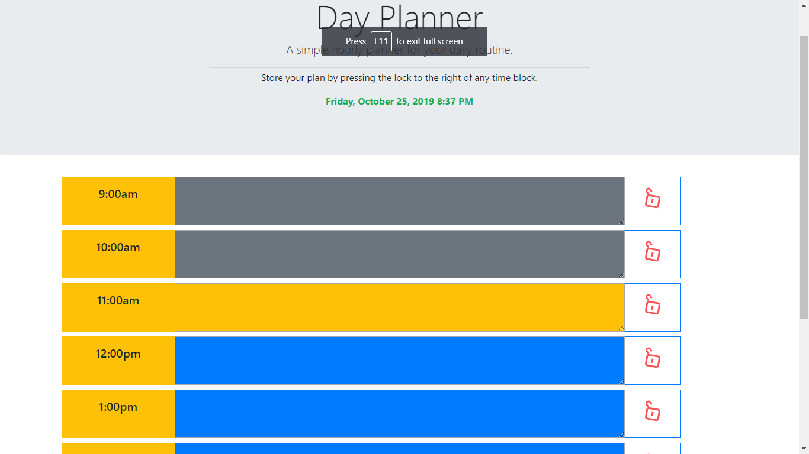

# 05-day-planner
A daily planner made using JavaScript, Bootstrap, and JQuery

lock forked from : https://codepen.io/skwintz/pen/GQgwbx

### Table of Contents
- [Description](#Description)
- [Concepts](#Concepts)
- [Technologies](#Technologies)
- [Lanuages-Used](#Languages-Used)
- [Screenshot](#Screenshot)
- [Link](#Link)
- [Resources](#Resources)

### Description

Using moment.js, local storage, and JavaScript logic, I created a daily planner which tracks to-dos for each hour of the day.

The user can input text into each block and lock in the text to save it into their local storage.  Clicking the lock again will unlock it, deleting the text from their local storage.

### Concepts

##### Moment.js

    ..* Checking the time on the user's computer to manipulate data within my program.

##### JQuery methods

    ..* Used a wide variety of JQuery methods for functionality within my code.

##### Functions

    ..* Functions allow us to create modules of code which can be reused throughout the program.  Functions also help with organization and efficency from a UX perspective.

##### HTML and JavaScript communication

### Technologies

- [Bootstrap](https://getbootstrap.com/) - CSS Framework
- [Flexbox](https://developer.mozilla.org/en-US/docs/Learn/CSS/CSS_layout/Flexbox) - Resource used within Bootstrap
- [Moment.js](https://momentjs.com) - Moment.js
- [Lock](https://codepen.io/skwintz/pen/GQgwbx) - Lock icon and animation

### Languages Used

- HTML
- CSS
- JavaScript

### Screenshot

### Link

Deployed Webpage

https://astrobeef.github.io/05-day-planner/

### Resources

https://w3schools.com

https://getbootstrap.com/docs/4.1/getting-started/introduction/

https://developer.mozilla.org/en-US/docs/Web/JavaScript/Reference/Global_Objects/Array/isArray

https://stackoverflow.com/questions/175739/built-in-way-in-javascript-to-check-if-a-string-is-a-valid-number

http://www.asciitable.com/

http://www.momentjs.com/
++